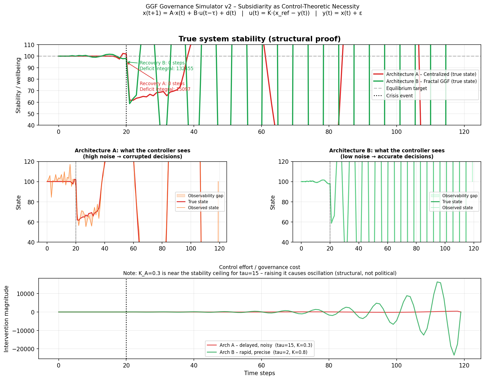
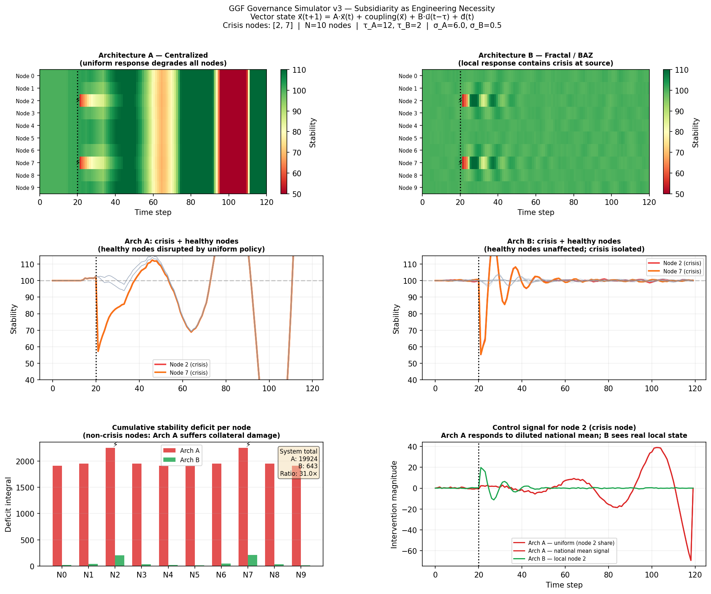

# GGF Governance Simulator

An open-source simulator modelling governance systems as feedback control systems, demonstrating how latency and signal fidelity determine the structural stability limits of institutional architectures.

Companion code to the whitepaper **[Governance Stability Simulator: A Control-Theoretic Model of Institutional Adaptation](https://www.bjornkennethholmstrom.org/whitepapers/governance-stability-simulator)**.

## The core argument

Governance systems are feedback systems. They observe the state of the world, process that information through institutions, and produce interventions intended to correct deviations from desired conditions. Like all feedback systems, their performance is determined by measurable structural properties — primarily latency (the delay between a crisis and a response) and signal fidelity (the accuracy of information reaching decision-makers).

These properties place hard mathematical ceilings on what any governance architecture can achieve. The simulator makes this concrete and visual.

## Simulations

### v2 — Single-node scalar model (`ggf-simulator-v2.py`)

Demonstrates the latency-gain ceiling and the observability gap using a single scalar state variable. Shows that:

- High latency forces low controller gain (structural, not political)
- Low signal fidelity produces a corrupted picture of reality that the controller acts on
- The gap between what Architecture A *thinks* is happening and what is *actually* happening is the observability failure made visible



### v3 — Ten-node vector model (`ggf-simulator-v3.py`)

Extends to a network of ten coupled nodes and introduces a localized shock to two nodes. Demonstrates the **averaging problem**: a centralized controller aggregating local signals into a national mean destroys spatial information, simultaneously under-serving crisis nodes and disrupting healthy ones. Shows that subsidiarity is an engineering requirement, not a political preference.



### v3-unadjusted — Instability demonstration (`ggf-simulator-v3-unadjusted.py`)

The original v3 with `K_B = 0.85`, which exceeds the stability ceiling for `tau_B = 2`. Produces oscillatory instability in Architecture B. Included deliberately: it demonstrates that distributed systems have their own stability constraints, and that local autonomy without coordination protocols generates its own failure mode.

## Architecture comparison

| Parameter | Architecture A (centralized) | Architecture B (fractal/distributed) |
|---|---|---|
| Latency `τ` | 12 | 2 |
| Observation noise `σ` | 6.0 | 0.5 |
| Controller gain `K` | 0.30 | 0.45 |
| Response topology | Uniform broadcast from national mean | Per-node local response |

The gain values are not arbitrary choices — they reflect the stability ceiling imposed by each architecture's latency. Architecture A *cannot* use a higher gain without inducing instability, regardless of resources or political will.

## Running the simulations

Requires Python 3.8+ with NumPy and Matplotlib:

```bash
git clone https://github.com/BjornKennethHolmstrom/ggf-governance-simulator
cd ggf-governance-simulator
pip install numpy matplotlib
python ggf-simulator-v3.py
```

Both simulations are seeded for reproducibility (`numpy.random.default_rng(seed=7)`). Running with default parameters reproduces the figures in the whitepaper exactly.

## Modifying the parameters

Architectural parameters are defined at the top of each script. Varying `tau_A`, `sigma_A`, `K_A` and their Architecture B counterparts changes the quantitative outputs while preserving the qualitative structural relationships — provided gain values remain below the stability ceiling for their respective latencies.

The stability ceiling approximation is:

```
K_max ≈ 1 / (τ · |A|)
```

For `tau_B = 2` and `A = 0.95`, this gives a ceiling of approximately 0.53. `K_B = 0.45` is the working value; `ggf-simulator-v3-unadjusted.py` shows what happens at `K_B = 0.85`.

## Intellectual lineage

The mathematics here is not new. Control theory, cybernetics, and the Law of Requisite Variety were developed in the mid-twentieth century by Norbert Wiener, Ross Ashby, Stafford Beer, and others. This simulator applies those established tools to governance architecture comparison.

This code was developed through an iterative human-AI collaborative process. See Appendix C of the whitepaper for a full account of the methodology and the primary literature the framework draws from.

## License

MIT

## Related work

- [The Architecture of Stability](https://www.bjornkennethholmstrom.org/whitepapers/architecture-of-stability) — the broader systems-theoretic framework this simulator operationalizes
- [Global Subsidiarity Index](https://www.svensksubsidiaritet.se/ramverk/gsi/) — a measurement framework for the structural variable this simulator demonstrates
- [Global Governance Frameworks](https://www.globalgovernanceframeworks.org) — the wider project
